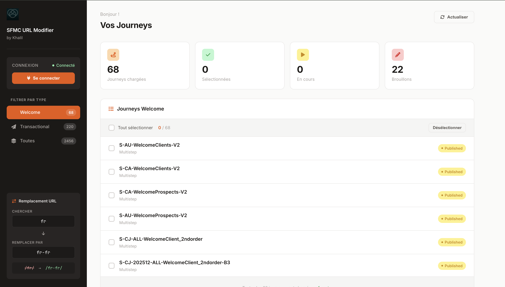

# SFMC URL Modifier

## C'est quoi ?

On a un problème sur nos emails Marketing Cloud : des milliers d'URLs pointent vers `/fr/` alors qu'elles devraient pointer vers `/fr-fr/`. Modifier ça manuellement dans chaque email de chaque journey prendrait des semaines.

Cet outil automatise le travail. Il se connecte à l'API SFMC, récupère les emails contenus dans les journeys, détecte les URLs à corriger, et applique les remplacements en masse. Le tout avec un dry-run obligatoire avant toute modification pour éviter les erreurs.

Le remplacement est intelligent : il gère les différents contextes HTML et AMPscript (URLs dans des `href=""`, dans des fonctions AMPscript entre quotes, avant des balises fermantes, etc.) et ne touche jamais aux URLs déjà en `/fr-fr/`.

## Les 3 outils disponibles

```
sfmc-url-modifier/          → CLI pour les journeys transactionnelles
sfmc-url-modifier-ui/       → Interface web visuelle (Flask, port 5001)
sfmc-welcome-url-modifier/  → CLI pour les journeys Welcome
```

| Je veux... | Utiliser |
|------------|----------|
| Traiter quelques journeys à la main, visualiser les résultats | **Web UI** |
| Lancer un batch sur toutes les transactionnelles | **CLI Transac** |
| Lancer un batch sur les journeys Welcome uniquement | **CLI Welcome** |

Chaque outil a son propre README avec les instructions détaillées. Ce qui suit est un guide rapide pour démarrer.

## Prérequis

- Python 3.8+
- Un Installed Package SFMC avec les permissions Journey et Assets (lecture + écriture)
- Les credentials associées (Client ID, Client Secret, Subdomain, MID)

## Configuration SFMC

Créer un fichier `.env` à la racine du sous-projet utilisé :

```
SFMC_CLIENT_ID=votre_client_id
SFMC_CLIENT_SECRET=votre_client_secret
SFMC_SUBDOMAIN=mcXXXXXXXX
SFMC_MID=123456789
```


## Quick Start — Interface Web

```bash
cd sfmc-url-modifier-ui

# Créer un environnement virtuel Python
python3 -m venv venv
source venv/bin/activate

# Installer les dépendances
pip install -r requirements.txt

# Configurer les credentials
cp .env.example .env
# → Ouvrir .env et remplir les 4 variables ci-dessus

# Lancer le serveur
python app.py
```

Ouvrir **http://localhost:5001** dans le navigateur. Se connecter, sélectionner les journeys, puis scanner → analyser → exécuter.

## Quick Start — CLI

```bash
cd sfmc-url-modifier

# Créer un environnement virtuel Python
python3 -m venv venv
source venv/bin/activate

# Installer les dépendances
pip install -r requirements.txt

# Configurer les credentials
cp .env.example .env
# → Ouvrir .env et remplir les 4 variables ci-dessus

# Vérifier que la connexion SFMC fonctionne
python test_connection.py

# Lister les journeys disponibles
python main.py -m list-journeys

# Analyser une journey (dry-run, ne modifie rien)
python main.py -m analyze -j "JOURNEY_ID"

# Si le dry-run est OK, appliquer les modifications
python main.py -m execute -j "JOURNEY_ID" --refresh
```

## Interface Web

<!-- Ajouter screenshot ici -->


## Comment fonctionne le remplacement

L'outil cherche `/fr/` dans le HTML des emails et le remplace par `/fr-fr/`. Il prend en compte 6 contextes différents pour ne rien casser :

| Contexte | Avant | Après |
|----------|-------|-------|
| Chemin standard | `/fr/page` | `/fr-fr/page` |
| Fin d'attribut HTML | `href="/fr"` | `href="/fr-fr"` |
| Chaîne AMPscript (double) | `"/fr"` | `"/fr-fr"` |
| Chaîne AMPscript (simple) | `'/fr'` | `'/fr-fr'` |
| Avant une balise | `/fr<` | `/fr-fr<` |
| Parenthèse AMPscript | `('/fr')` | `('/fr-fr')` |

Sécurités :
- Les URLs déjà en `/fr-fr/` ne sont jamais modifiées
- Le moteur vérifie les 3 caractères précédant chaque match pour éviter les faux positifs
- Le dry-run (`analyze`) permet de vérifier chaque changement avant exécution

## Architecture technique

```
Browser ──► Flask (port 5001) ──► sfmc_api ──► SFMC REST API
                                     │
                                  Cache 5 min
```

L'API SFMC renvoie 6000+ journeys. Le premier appel prend environ 100 secondes. Un cache en mémoire (TTL 5 min) stocke le résultat pour que les appels suivants soient quasi instantanés (~0.02s). Les journeys en statut "Stopped" sont exclues du cache pour réduire le volume de données (~60% du total).